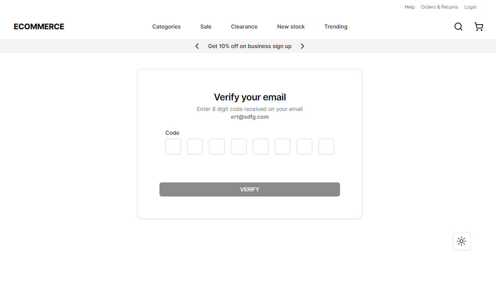

# E-Commerce Website

<h4>
Welcome to our e-commerce website's sign-up and login flow repository! Below you will find all the necessary information to understand the project, its features, and the technologies used.
</h4>
<br>
<p >
 This project aims to create a simple and intuitive sign-up and login flow for an e-commerce website. Users can register, log in, and mark their interests in various product categories. The website utilizes Next.js for both frontend development,  API creation, Prisma as the ORM for database interaction, Database used is Postgres (hosted on https://neon.tech/) and Tailwind CSS for styling.
</h4>
</br></br>

</br>

<p >Live Site :   </p>


## Key Features 🔥

1. ✨ **User Registration**: New users can register by providing necessary details such as email, username, and password.
2. 🔐 **User Login**: Existing users can log in using their credentials.
3. 🔢 **Email Verification**: Users receive an email with a one-time password (OTP) for verification during the registration process.
4. ⚙️ **Session Management**: Custom implementation using cookies with Iron Session.
3. 📦 **Category Selection**: Upon logging in, users can mark their interests in product categories from a list of available options.
4. 🔄 **Pagination**: Category selection interface is paginated, allowing users to navigate through different pages of categories.
5. 📝 **Persistent Category Selection**: User's selected categories are stored in the database, ensuring they remain selected upon subsequent logins.
6. 🖥️ **Static Header**: A static header is present across all pages providing consistency in navigation.
7. ⚡**Next.js and Tailwind CSS Magic** : Application leverages Next.js for a powerful and efficient frontend. - Tailwind CSS brings flexibility and style, resulting in a sleek and modern design.
8. 📱  **Mobile Magic**: `Application is designed to shine on all devices, ensuring a seamless experience on mobile phones and tablets.
9. 🌓 **Adaptive Light and Dark Modes:**`  Customize your view of your choice with light or dark mode. - Tailor your environment to suit your visual preferences.


# Technologies Used 🧑‍💻
`Next.js`: Framework for building both the frontend and backend apis.

`Faker.js`: Used to generate radom categories of data.

`Postgres DB`: RDBMS for data storage., hosted on hosted on https://neon.tech/

`Prisma`: ORM for database interaction.

`Tailwind CSS`: Utility-first CSS framework for styling.

`Vercel`: Hosting platform for deploying the application.

`Email JS`: Used for sending email verification codes.

`React Hook Form & ZOD` : For form submission and validations.

# Steps for setup and usage

## Installation 💻

- Clone the Repository and Open your terminal.
- Download all the file from the repo and keep it in a folder.
- Run command `pnpm install` or `yarn install` or `npm install` (pnpm is prefered).
- Running the above command will install all the required dependicies to run the application.
- Rename .env.example to .env and fill in necessary environment variables.
- Set up and run your MySQL/Postgres database.
- Go to `.env` in  root, if not found create one.
- Replace the keys & save it. This would give access to mongodb.
```text
    DATABASE_URL = 'your databse uri'
    SECRET_KEY = '' // 32 char length secret key for session storage
```
- Start the development server by running `pnpm run dev` or `npm run dev`

At this point application is ready visit `http://localhost:3000/`
To use application, simply register, verify the email and add some categories in to the database and start enjoying it.

<br>

## Database Interaction

- `POST` - `http://localhost:3000/api/categories/add` : To populate the database with categories.
- `GET` - `http://localhost:3000/api/categories` : To retrieve all the categories.
- `POST` - `http://localhost:3000/api/update-wishlist` : To update the category to wishlist
- `POST` - `http://localhost:3000/api/login` and `http://localhost:3000/api/register`

<br>


<br>


<br>




<div align="center">
    <h3 align="center">💫 Developed with ❤️ by <a href="https://thegagan-portfolio.vercel.app/">Gagan Kumar</a> ╭❤️～ </h3>
    <p align="center"> Don't be shy to contact 📫 <a href="mailto:example@gmail.com">hellothegagan@gmail.com</a>
 |
     🤙 +91-9036644552</p>
</div>

